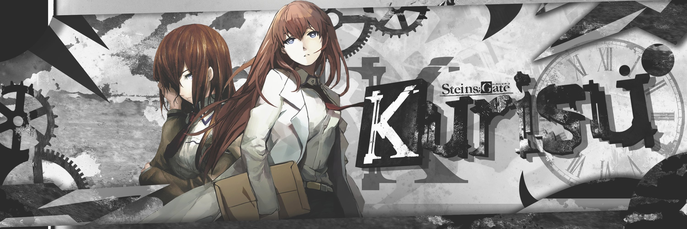

# Hi Everyone, I'm CriosChan !

I'm a developer looking to get into cybersecurity.

## About me

- I'm always looking to learn new things.
- Currently working on SpringBoot and Angular.
- I love anime and programming.
- Member and developer for the [Amaterasu Traduction group](https://mangadex.org/group/9b5b5a4f-0c0a-4b52-996a-dc09e718e722/amaterasu-traduction?tab=titles).

### Connect with me:

[][youtube]
[][instagram]
[][discord]
 

### Languages and Tools:

 
 

[youtube]: https://youtube.com/crios_chan
[instagram]: https://instagram.com/crios_chan
[discord]: https://discord.me/crioschan
